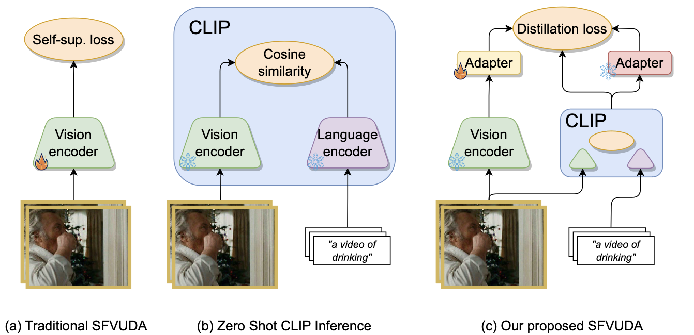

# DALL-V

This is the official implementation of the paper [The Unreasonable Effectiveness of Large Language-Vision Models for Source-free Video Domain Adaptation](https://arxiv.org/abs/2308.09139) (ICCV2023) by Giacomo Zara, Alessandro Conti, Subhankar Roy, Stéphane Lathuilière, Paolo Rota and Elisa Ricci.

A sample bash script in stored  in the `scripts` directory, containing a sample command for each stage of the proposed pipeline. The `txt` directories contains the file lists for each considered benchmark: these files can and should be modified according to the paths used locally. The file `dallv.yaml`can be used to build the conda environment where to run the experiments (modify the prefix according to your file system). Any experiment can be run by setting the `experiment` flag in the command to any of the options available in `configs/experiment`.
